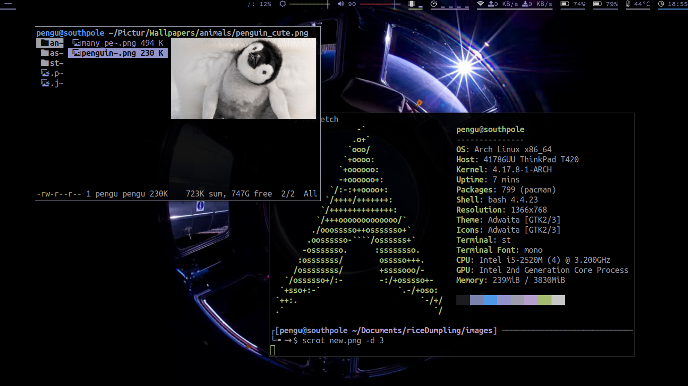

# What's this
My Race Inspired Car Enhancement (RICE).
The files constantly change, some of the screenshots might be outdated as well.
Generally the one on top marked "latest" is always up to date.

# Screens

# Stuff used 
These are the stuff that I use. They all have configs here apart from the suckless stuff.

- [patched st](https://github.com/podocarp/st)
- [patched tabbed](https://github.com/podocarp/tabbed)
- [patched dwm](https://github.com/podocarp/dwm)
  - dwmstatus included inside
- vifm
  - highlight
  - libcoco
  - zathura
- pywal
  - feh
  - [schemer2](https://github.com/thefryscorer/schemer2)
- vim
  - Vundle and others
- xcompmgr xbindkeys xmodmap xinput
- ALSA
- fonts (included)
  - Ubuntu from [nerd fonts](https://github.com/ryanoasis/nerd-fonts)
  - IBM Plex Mono
  - Adobe Source Han

# Usage
`./setup.sh`.
This script makes all your configs a symlink of whatever files are in here, so it *will wipe your current configs*.

# Notes
There might be some changes that you don't like. This section lists a few changes that might annoy you:

| Change | Location of config |
| --- | --- |
| Caps is Esc | `.Xmodmap` |
| Synaptic Trackpad disabled by default | `.xprofile` |
| Alpha fade in/out delay | `.xprofile` |
| Fn buttons | `.xbindkeysrc` |

# Keybinds
Here are some extra stuff I added.
Most of the other keybinds are default unless stated otherwise.

## vifm
| Key combo | Function |
| --- | --- |
| bw | Set background and generate new theme based on the image under your cursor. |
| N | New tab |
| gq | Close tab |
| Ctrl r | Restart and reloads config |
| R | Alternative opening methods |

## vim
The more obvious ones:

| Key combo | Function |
| --- | --- |
| Ctrl c | Copies to system clipboard. Requires vim compiled with +clipboard. |
| Ctrl v | In insert mode, pastes from system clipboard. Requires +clipboard. |
| Ctrl+hjkl | Replaces Ctrl+W+hjkl for split focus. |
| Ctrl+w+hjkl | Replaces Ctrl+w+HJKL for split motion. |
