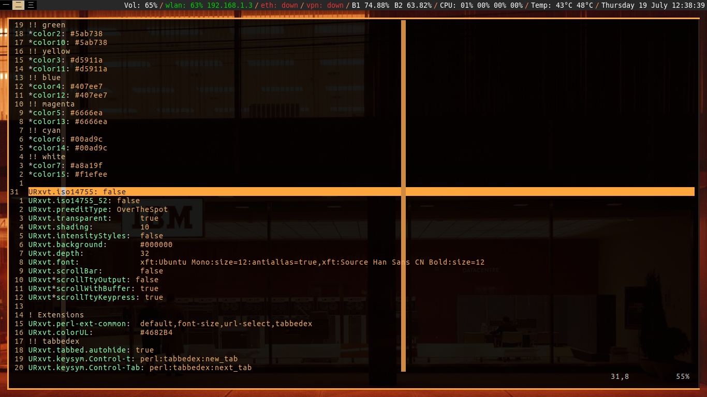
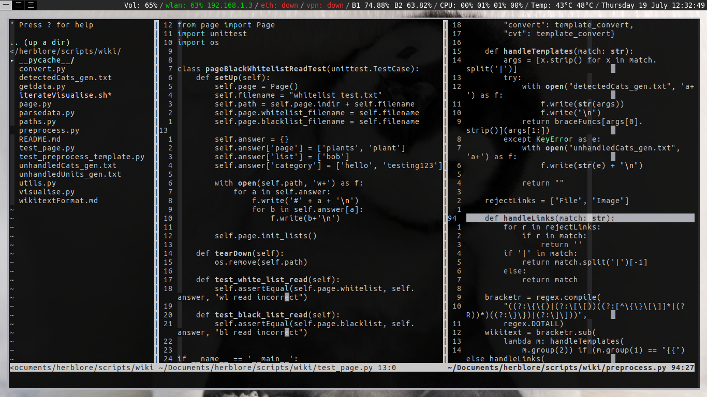
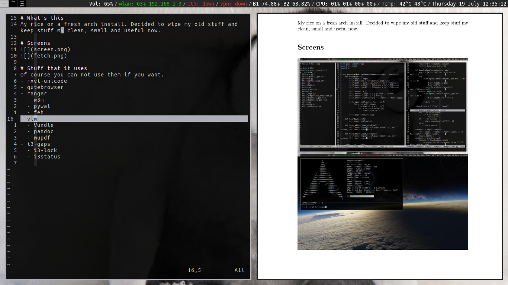

# What's this
My Race Inspired Car Enhancement (RICE).
The files constantly change, some of the screenshots might be outdated as well.
Generally the one on top marked "latest" is always up to date.

# Screens

Latest screen:

You can change the color theme by changing your wallpaper:

Color themes propagate into vim too

Generate and refresh markdown and latex previews with pandoc in vim:

# Stuff that I use 
Of course you can not use them if you want.
Dependencies are just there for extra rice, like ranger uses w3m for image previews. You can leave w3m out if you don't care about that.

Fonts wise, I really suggest [nerd font](https://github.com/ryanoasis/nerd-fonts) because it just werks, and has all the glyphs.

- rxvt-unicode
- ranger
  - w3m (image preview)
  - pywal (set wallpaper & generate theme)
  - feh (set wallpaper, invoked by pywal)
  - schemer2 (invoked by pywal as a color generator. can be left out.)
 - vim
  - Vundle
  - pandoc (generate live preview of markdown and stuff)
  - mupdf (open the live preview)
- i3-gaps
  - i3-lock
  - polybar
- fonts
  - [nerd font](https://github.com/ryanoasis/nerd-fonts)
  - Adobe Source (CN output)

# Usage
Just clone it anywhere, then run `./setup.sh`.
This script makes all your configs a symlink of whatever files are in here, so it *will wipe your current configs*.
Otherwise you can just take a peep through and copy whatever you like.
It's not a foolproof script yet, for example vim will throw a bunch of errors because it doesn't get Vundle for you

# Keybinds
Here are some extra stuff I added.
Most of the other keybinds are default (I think), such as those in i3.

## General
| Key combo | Function |
| --- | --- |
| Caps Lock | Esc |

## ranger
| Key combo | Function |
| --- | --- |
| bw | Set background and generate new theme based on the image under your cursor. |
| bl | Set lock screen wallpaper based on the image under your cursor. Does not generate theme. |

## vim
There's really quite a few here, please read the config. This is just the more obvious ones:

| Key combo | Function |
| --- | --- |
| ii | Get out of insert mode. Might replace it because I actually found a word that contains `ii`, `triarii`. |
| F5 | Generate a temp pdf if you're in a markdown doc. Also refreshs mupdf if you used F4. |
| F4 | Opens mupdf to view your preview generated by F5. |
| F3 | noh. After you search for something F3 will disable the highlighting. |
| F1 | Calls ale plugin to format your code. You must have everything installed properly, of course. Also doesn't work for everything under the sky yet. |
| Ctrl c | Copies to system clipboard. Different from `y`. Requires vim compiled with +clipboard. |
| Ctrl v | In insert mode, pastes from system clipboard. Requires +clipboard. |
| Ctrl+hjkl | Replaces Ctrl+W+hjkl for split focus. |
| Ctrl+w+hjkl | Replaces Ctrl+w+HJKL for split motion. |
