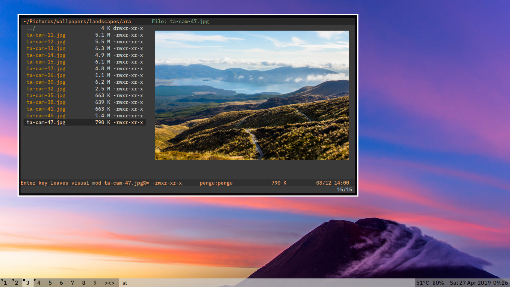

# What's this
My config and dotfiles. Focused on function over form.

# Screens
Hey, nobody actually works like that:

# Stuff used 
These are the stuff that I use. They all have configs here apart from the suckless stuff.

- [patched st](https://github.com/podocarp/st)
- [patched dwm](https://github.com/podocarp/dwm)
  - my dwmstatus included (update git submodules after cloning!)
- vifm
- nvim
  - Vundle
- [ueberzug](https://github.com/seebye/ueberzug)
- zathura
- Wallpapers  
  - pywal
  - [schemer2](https://github.com/thefryscorer/schemer2)
  - feh
- xcompmgr xbindkeys xmodmap xinput
- fonts (included)
  - IBM Plex Mono
  - Adobe Source Han

# Usage
`./setup.sh`.
This script makes all your configs a symlink of whatever files are in here, so it *will wipe your previous configs*.

# Notes
There might be some changes that you don't like. This section lists a few changes that might annoy you:

| Change | Location of config |
| --- | --- |
| Caps is Esc | `.Xmodmap` |
| Synaptic Trackpad disabled by default | `.xprofile` |
| Alpha fade in/out delay | `.xprofile` |
| Fn buttons | `.xbindkeysrc` |

# Keybinds
Here are some extra stuff I added.
Most of the other keybinds are default unless stated otherwise.

## vifm
If it doesn't start, try checking `~/.config/scripts/vf` and seeing if it is pointing to the right path where you installed vifm.

| Key combo | Function |
| --- | --- |
| bw | Set background and generate new theme based on the image under your cursor. |
| N | New tab |
| gq | Close tab |
| Ctrl r | Restart and reloads config |
| R | Alternative opening methods |

## vim
The more obvious ones:

| Key combo | Function |
| --- | --- |
| Ctrl c | Copies to system clipboard. Requires vim compiled with +clipboard. |
| Ctrl v | In insert mode, pastes from system clipboard. Requires +clipboard. |
| Ctrl+hjkl | Replaces Ctrl+W+hjkl for split focus. |
| Ctrl+w+hjkl | Replaces Ctrl+w+HJKL for split motion. |
